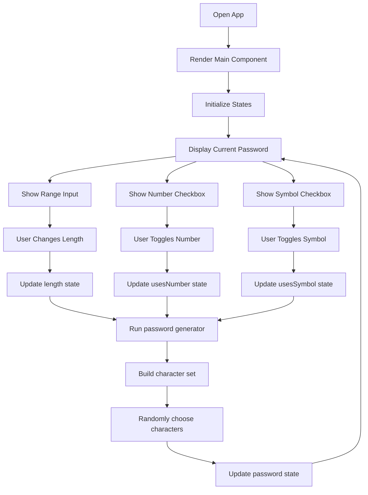

# Password Generator Flowchart

## How the flow works

1. The app loads and renders the main component.
2. The current password and controls are shown.
3. When the user changes a setting, React updates the matching state.
4. The password generator runs again.
5. A new password is generated and displayed.
